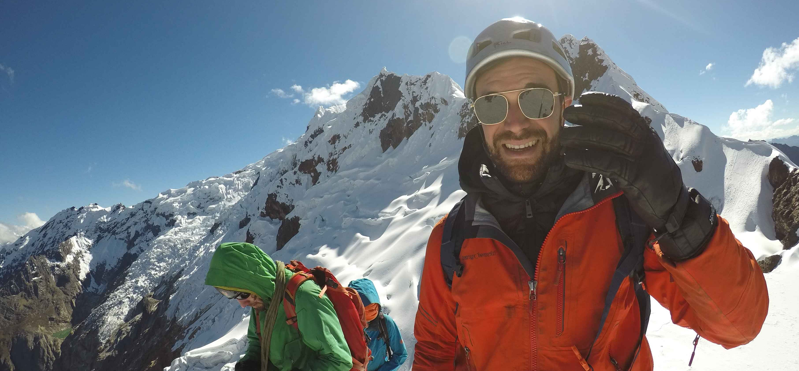

I am Matias R. Vazquez, Lead Data Scientist at Deloitte Ventures, where we have a ton of fun building great tech products. I believe that the combination of scientific rigour, creativity and agile ways of working can give rise to wonderful things.

I am interested in all aspects of Machine Learning (ML) - from the abstract mathematical ideas to the MLOps practices that turn them into products. I have a track record of ML projects in various  industries - some of my favorites have been: mathematical optimisation for OR, Monte Carlo simulations for logistics and NLP in healthcare.

I am (and always will be) a physicist. Before entering the AI industry, I did academic research in particle physics at the University of Paris-Saclay, where I obtained my PhD in 2017. I studied the phenomenology of Higgs Bosons at CERN's particle collider @ Geneva. I am also interested in quantum computing and information. You can find a list of my scientific publications in [Google Scholar](asahttps://scholar.google.com/citations?user=9fba9FMAAAAJs).

In my free time I enjoy reading, surfing, traveling and trying new sports.
